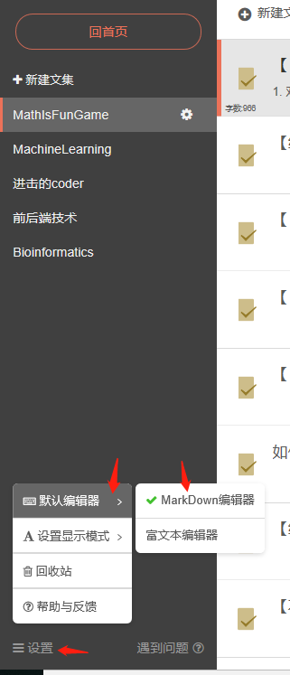
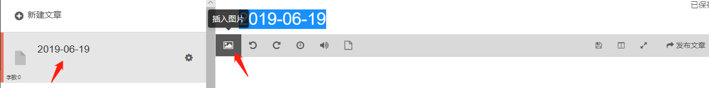
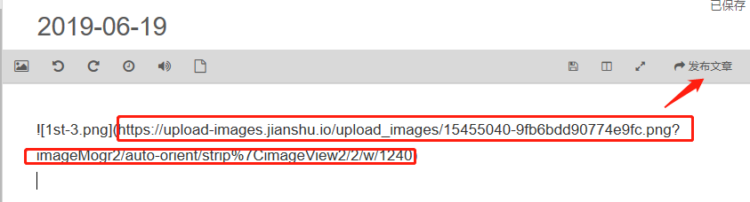
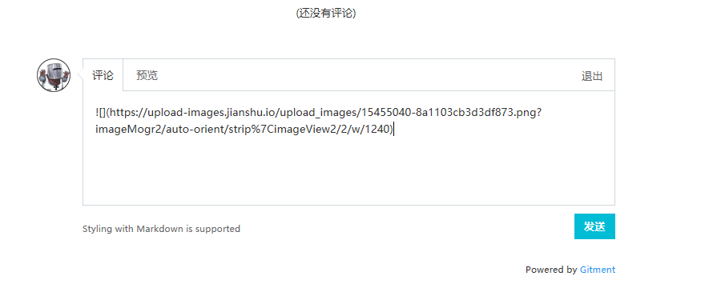
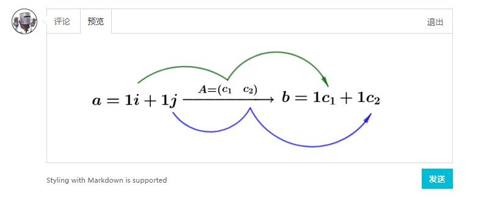

# 《生信与机器学习兴趣小组》线上互动讨论平台说明

为了方便说明，将本兴趣小组简称为**BIML-club**

目前暂时将线上互动讨论平台放在本人的github博客上，链接：https://ming-lian.github.io

第一期的分享的讨论帖已经在上面发布了（[点这里](https://ming-lian.github.io/2019/06/19/Bioinfo-ML-Club-1st/)），请小伙伴们到讨论帖的最底部的评论部分进行评论


注意：

> 需要登录github账号才能进行评论，所以目前还没有github账号的小伙伴们，请先去注册一个

该评论栏支持Markdown语法的解析，不知道什么是Markdown的请自行百度

如何在评论中插入图片？

> 若需要在评论中插入图片，可以通过Markdown语法中的
>
> ```
> 
> ```
>
> 来实现，需要将上面的`URL`替换成你需要插入的图片的链接（所以这个图片必须已经被上传至网上了，这样你才有对应这个图片的有效链接）

下面介绍一种最为简单的上传图片的平台——简书

> 先登录简书，然后在个人主页上选择【写文章】
>
> 
>
> 这编辑页面设置编辑器模式为Markdown模式
>
> 
>
> 然后新建一篇文章
>
> 
>
> 新建一篇文章后会在中间栏新建一篇默认名为当前日期的文章，然后在右侧的编辑栏中的菜单选项中点击插入图片
>
> 
>
> 在本地选择一张图片上传之后，会得到下图中框中的URL地址
>
> 
>
> 点击【发布文章】将这篇文章发表后，你就可以获得这张图片的有效链接了，那么你就可以在讨论贴的评论栏以下面的方式插入这张图片了
>
> 
>
> 
